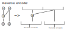
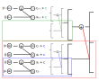

# Домашние работы

## [**Содержание**](./../README.md)

* [**Дз 1. Спасение из пиратского плена**](./pirates.md)
* Дз 2. Двоичный симметричный канал со стираниями (not implemented)
* **Дз 3. Систематическое кодирование полярных кодов**

## Условие

Необходимо разработать алгоритм систематического кодирования полярных кодов со сложностью O(n log n).

#### Notes

***Систематическими*** называют такие коды, в которых информационные и корректирующие символы расположены по строго
определенной системе и ***всегда занимают строго определенные места в кодовых комбинациях***. Они являются равномерными
кодами, т. е. все комбинации кода с заданными корректирующими способностями имеют одинаковую длину.

## Решение

#### Обозначения

* **N** - длина полярного кода (**N** = 2^**m**);
* **K** - длина сообщения;
* **q** - алфавит
* **C** - кодовое слово (длины **N**);
* **U** - последовательность информационных бит (длины **K**);
* **D** - информационное слово (длины **N**);
* **А** - матрица Арикана;
* **G** - **A**^{⊗**m**}
* ***F*** - позиции замороженных бит
* ***I*** - позиции информационных символов (***I*** = {0, 1, ..., **N** - 1} \ ***F***)

#### Постановка задачи

Требуется решить систему **C = D G**, где в кодовом слове **C** на позициях ***I*** расположена последовательность
информационных бит **U**, а в информационном слове **D** на позициях ***F*** расположены 0.

#### Предлагаемый алгоритм

* На оставшиеся места в кодовом слове **C** запишем неизвестные x_j, где j - порядковый номер позиции в слове.
  Количество неизвестных x - (**N** - **K**).
* На оставшиеся места в информационном слове **D** запишем неизвестные y_i, где i - порядковый номер позиции в слове.
  Количество неизвестных y - **K**.
* На основе схемы, обратной к схеме кодирования, получим **N** уравнений первой степени от одной неизвестной, и решим
  систему.

Многочленом будем называть - многочлен первой степени вида **x_i + c**

##### Рассмотрим схему обратную к схеме кодирования

Замечание: схема обратная к схеме кодирования в общем случае не является декодером (т.к. данный алгоритм оперирует
символами из алфавита **q**).

###### Утв 1. Правую часть можно декодировать без учёта левой.

###### Утв 2. В многочлене не может быть более 1 неизвестной (при решении справа налево).

###### Утв 3. В многочлене есть неизвестная, если многочлен находится на месте замороженных бит.

###### Лемма 1. В получаемых уравнениях будет 1 неизвестная.

Из утв. 2 и 3, и того что неизвестные в инф слове не пересекаются по позициям в кодовом слове, следует что: либо будет
неизвестная в многочлене, либо в равенстве (т.е. в ур-нии будет, либо y, либо x).

##### Визуализация предлагаемой схемы

Notes: цветная **С** - какая-то константа, полученная из правой части предыдущего шага.

##### Алгоритм поиска уравнений (рекурсивный)

* Если длина кодового слова 1 - решим уравнение.
* Иначе:
    * Разделим кодовое слово на две равные части;
    * Запустимся рекурсивно на правой части;
    * Сложим левую и правую часть (с подставленными значениями неизвестных) и запустимся рекурсивно;

Замечание 1: все операции в поле F_q.

Замечание 2: все операции можно выполнять in place.

В результате применения данного алгоритма получим значения всех неизвестных x_i, y_j

##### Асимптотика

* Решить N уравнений первой степени с 1 неизвестной - O(n);
* Найти N уравнений - O(nlog(n)):
    * Глубина рекурсии O(log(n));
    * Кол-во выполняемых операций O(n).

Итоговая асимптотика O(nlog(n));

##### Источники

[1] Милославская В. Методы построения и декодирования полярных кодов : дисс. канд. техн. наук / В.Д. Милославская ;
Санкт-Петербургский государственный политехнический университет. — 2014.

[2] Arikan E. Systematic polar coding / IEEE Communications Letters. — 2011. — August. — Vo